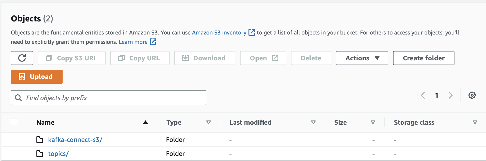
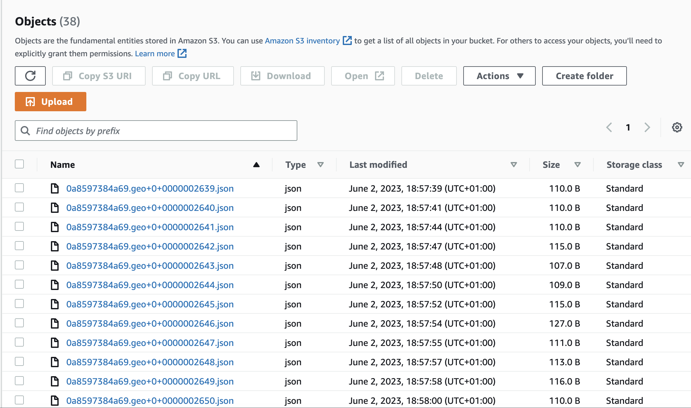
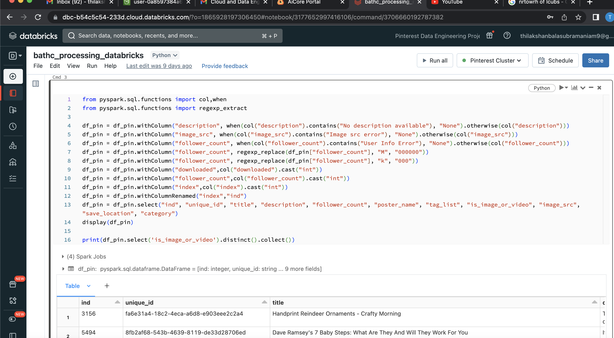
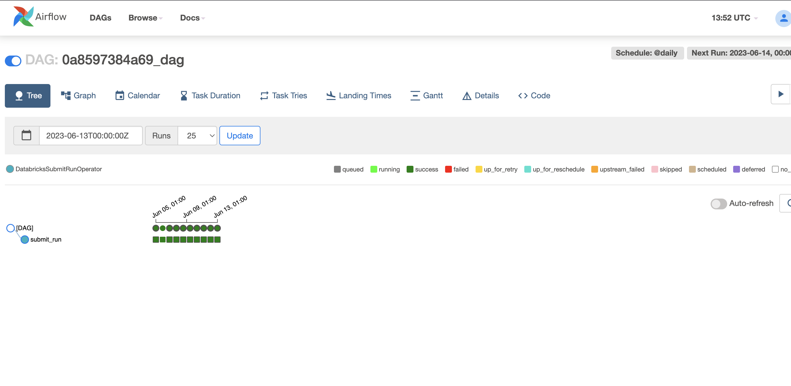
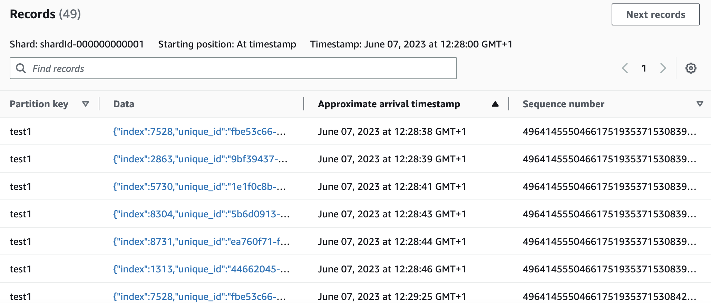
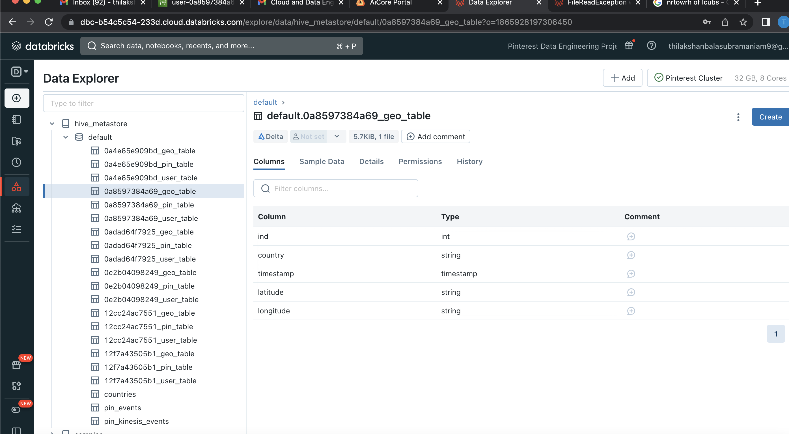

# Pinterest Data Pipeline

1. Downloaded Pinterest Infrastructure (data resembling data received by the Pinterest API when a post request is made by a user uploading data to Pinterest). The infrastrucutre contains three tables which are as follows:
    -pinterest_data
    -geolocation_data
    -user_data
2. Configured an EC2 instance to use as an Apache Kafka client machine which I will then create topics on. Then I set up MSK connect to allow the MSK cluster to send data to a S3 bucket and any data that gets sent to the topic will be automatically saved and stored in a dedicated S3 bucket.

    

3. Created an API in AWS API Gateway which will send data to the MSK cluster using the MSK connect connector. I built a Kafka REST proxy integration method for the API then set up the Kafka REST proxy on my ec2 client. Then I started the REST proxy on my EC2 client machine and modified user_posting_emulation.py to send data to my API, when in turn will send the data to the MSK Cluster using the plugin-connector pair previously created. The data will be stored in the S3 bucket.

    

4. Read data from AWS into databricks for batch processing,. I cleaned and ran computations using spark on databricks. In order to clean and query my batch data, i will need to read the data from my S3 bucket into Databricks. I will need to mount the S3 bucket to the Databricks account first. I will not need to create a new Access Key and Secret Access key for Databricks as I have been granted full access to S3 on the Databricks account and the credentials have already been updated to Databricks for me.

    

5. Orchestrated Databricks Worloads on AWS MWAA by uploading a DAG to a MWAA enviornment and triggering it to run at a given time. 

    

6. Read data into databrickks for stream processing. I sent data to the Kinesis streams, read and transformed the data using databricks and wrote the streaming data to delta tables. I configured my previously created REST API to allow it to invoke Kinesis actions. My API is able to:
    - List the streams in Kinesis
    - Create, describe and delete streams in Kinesis
    - Add records to streams in Kinesis
I sent requests using user_posting_emulation_streaming to my API, which adds one record at a time to the streams that I have created.

    

7. Then I read and transformed the data in databricks. Finally, I saved each stream in a delta table. 

    

